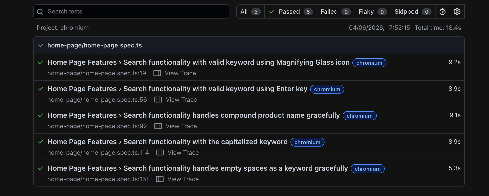
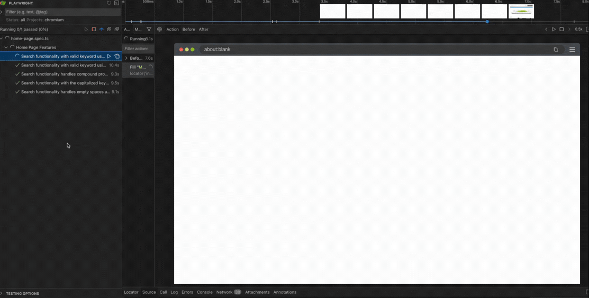

# Playwright Test Automation Framework (eCommerce Search Suite)

A robust, modular automated test suite built with **Playwright** and **TypeScript** targeting an OpenCart-based eCommerce platform. This project demonstrates industry best practices in test automation architecture, specifically utilizing the **Page Object Model (POM)** design pattern, data verification strategies, and structured test documentation.

---

## 🚀 Key Features & Architecture

- **Page Object Model (POM):** UI locators and action interactions are decoupled from the test scripts (`pages/HomePage.ts`), ensuring high reusability and isolated maintenance.
- **Dynamic Content Assertions:** Employs advanced asynchronous loops to dynamically validate search results across varying inventory counts without hardcoded arrays.
- **Robust Test Coverage:** Features a synchronized balance of high-priority smoke workflows and edge-case regression validations.
- **Precondition Isolation:** Optimizes execution speed and removes code duplication by leveraging Playwright's `beforeEach` life-cycle hooks.
- **CI/CD Pipeline Integration:** Setting up GitHub Actions to automatically trigger test suites on code push
- **Automated API Testing:** Implementing hybrid UI/API verification to increase execution speed

---

## 📊 Test Suite Coverage

The framework executes 5 distinct automated test configurations mapped closely to formal QA requirements:

| Test Case ID      | Type       | Scenario / Intent                                                                     | Dynamic Assertions                           |
| :---------------- | :--------- | :------------------------------------------------------------------------------------ | :------------------------------------------- |
| **TC_SEARCH_001** | Smoke      | Verify search functionality using a valid keyword via the Magnifying Glass icon.      | Grid layout rendering & active states        |
| **TC_SEARCH_002** | Smoke      | Verify search functionality using a valid keyword via the Enter key.                  | Grid layout rendering & active states        |
| **TC_SEARCH_003** | Regression | Verify search functionality handles compound product names missing spaces gracefully. | Empty-state message handling & 0-count logic |
| **TC_SEARCH_004** | Regression | Verify case insensitivity of the search functionality.                                | Intentional application logic testing        |
| **TC_SEARCH_005** | Regression | Verify edge case handling of whitespace-only queries.                                 | Tracking browser URL-encoding (`%20`) bugs   |

---

## 🛠️ Tech Stack & Prerequisites

- **Language:** TypeScript
- **Core Framework:** Playwright Test (Web-first assertions, parallel execution engine)
- **IDE:** Visual Studio Code

---

## 📊 Visual Execution Proof (Instant Review)

_For reviewers who wish to see the framework in action without local installation:_

### Interactive UI Mode Execution

Below is the execution timeline and DOM snapshot verification using Playwright's UI Runner:



## 🎬 Live Framework Demonstration

Below is a live recording of the first test of the automation suite:

</img>

### Headless Test Execution Log

```text
  5 passed (15.8s)
  To open last HTML report run:
    npx playwright show-report
```

---

## 🚀 Current Work in Progress

I am actively expanding this portfolio and am currently designing and implementing the **User Authentication Feature Test Suite**.

This includes:

- Completing comprehensive test planning and manual test design.
- Developing robust end-to-end test automation scripts to validate core authentication workflows.

_Note: New documentation and automated test scripts are being continuously pushed to this repository as they are developed._
